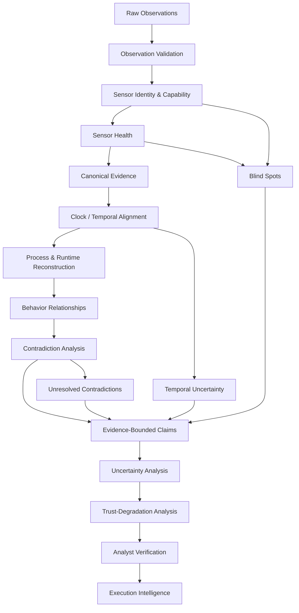
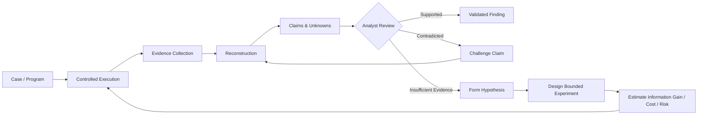
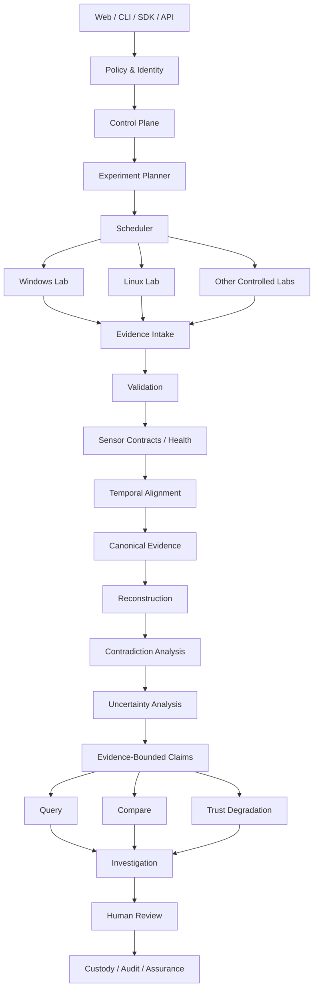

# ELENCHION

**Evidence-Bounded Execution Intelligence Under Hostile Scrutiny**

> **Every claim must survive cross-examination by its evidence.**

ELENCHION is an open research and engineering project investigating how defensible knowledge can be reconstructed from program execution when observation is incomplete, sensors have limits, clocks disagree, evidence conflicts, and uncertainty cannot honestly be eliminated.

It is not intended to become another verdict engine, malware dashboard, sandbox wrapper, or AI-generated reporting layer.

The central problem is narrower and harder:

> **How much of an execution do we actually know — and why are we justified in claiming that we know it?**

---

## The Problem

Traditional execution analysis often collapses a complex observation process into a simple pipeline:

```text
Sample
  ↓
Execution
  ↓
Events
  ↓
Detections
  ↓
Report
```

ELENCHION treats that abstraction as insufficient.

Two constraints define the research problem:

```text
Observed Behavior ≠ Complete Behavior
```

and:

```text
Event Seen     ≠ Fact Proven
Event Not Seen ≠ Fact Did Not Occur
```

An execution-analysis system may observe a process, file operation, memory transition, network event, or runtime artifact.

That observation alone does not establish:

* whether the sensor had complete coverage;
* whether events were lost;
* whether timestamps are directly comparable;
* whether another sensor disagrees;
* whether the observation was transformed;
* whether the evidence source can still be trusted;
* whether the conclusion is observed or inferred;
* whether an alternative explanation remains possible.

ELENCHION makes those boundaries first-class engineering data.

---

## Mission

For a program execution, ELENCHION is intended to make questions like these answerable:

```text
What executed?

What existed before execution?

What changed?

What is the strongest evidence for that change?

Which sensor produced the evidence?

Was that sensor capable of observing the phenomenon?

Was the sensor healthy?

Could observations have been lost?

Did another source disagree?

What was directly observed?

What was derived?

What was inferred?

What remains unknown?

How uncertain is the event ordering?

Which conclusions depend on a specific sensor?

What collapses if that sensor becomes untrusted?

Can another analyst reproduce the conclusion?

What evidence would reduce the remaining uncertainty?
```

The objective is not maximum telemetry.

The objective is:

> **maximum defensible execution knowledge.**

---

## Core Invariants

ELENCHION is being designed around several non-negotiable principles.

### 1. No Claim Without Provenance

A significant conclusion should be traceable toward:

```text
Claim
  ↓
Evidence
  ↓
Canonical Evidence Object
  ↓
Raw Observation
  ↓
Sensor
  ↓
Sensor Configuration
  ↓
Sensor Health
  ↓
Clock Domain
  ↓
Analysis Run
  ↓
Execution Environment
  ↓
Transformation
  ↓
Engine Version
```

### 2. Absence of Evidence Is Not Automatically Evidence of Absence

If no file-write event appears, possible explanations include:

```text
No write occurred.
The sensor could not observe that class of write.
The sensor lost events.
Collection was inactive.
Collection failed.
The event occurred outside the observed interval.
```

Those states must not silently collapse into one another.

### 3. Causality Is Not Temporal Order

```text
A happened before B
```

does not establish:

```text
A caused B
```

Temporal precedence, dependency, correlation, information flow, and causality must remain semantically distinct.

### 4. AI Is Not Evidence

AI-generated text, hypotheses, classifications, or explanations are not raw evidence.

AI may assist reasoning only if its outputs remain traceable to supporting evidence and are clearly identified as derived or hypothetical.

### 5. UNKNOWN Is a Valid Result

ELENCHION should be allowed to say:

```text
UNKNOWN
```

and ideally continue:

```text
Why it is unknown.
Which observation layer is insufficient.
Which conclusions are affected.
What additional evidence could reduce the uncertainty.
```

---

## Epistemic Model

ELENCHION currently distinguishes three independent dimensions.

### Claim State

| State          | Meaning                                                     |
| -------------- | ----------------------------------------------------------- |
| `OBSERVED`     | Directly supported by an observation within a defined scope |
| `DERIVED`      | Produced deterministically from other evidence              |
| `INFERRED`     | Supported indirectly through reasoning                      |
| `HYPOTHESIZED` | Proposed explanation awaiting sufficient evidence           |
| `CONTRADICTED` | Material evidence conflicts with the claim                  |
| `UNKNOWN`      | Available evidence does not justify a stronger state        |

### Observation State

| State                 | Meaning                                      |
| --------------------- | -------------------------------------------- |
| `AVAILABLE`           | Relevant observation capability was active   |
| `NOT_COLLECTED`       | Evidence was not collected                   |
| `PARTIALLY_COLLECTED` | Collection coverage is incomplete            |
| `COLLECTION_FAILED`   | Collection attempted but failed              |
| `UNOBSERVABLE`        | Current sensor cannot observe the phenomenon |
| `UNKNOWN_COVERAGE`    | Observation capability itself is uncertain   |

### Source Trust State

| State               | Meaning                                             |
| ------------------- | --------------------------------------------------- |
| `TRUSTED_FOR_SCOPE` | Source is accepted for the stated observation scope |
| `DEGRADED`          | Source remains usable but with material limitations |
| `UNTRUSTED`         | Source cannot support dependent conclusions         |
| `UNKNOWN`           | Trust cannot currently be established               |

These dimensions remain separate deliberately.

A claim may be `OBSERVED` while its source is `DEGRADED`.

A phenomenon may remain `UNKNOWN` because collection was `NOT_COLLECTED`.

A source may be `TRUSTED_FOR_SCOPE` while still being incapable of observing another event class.

---

## Evidence-Bounded Claim

A central research primitive is the **Evidence-Bounded Claim**.

Conceptually:

```text
EvidenceBoundedClaim
├── proposition
├── epistemic_state
├── supporting_evidence[]
├── contradicting_evidence[]
├── derivation
├── sensor_dependencies[]
├── observation_scope
├── temporal_bounds
├── environment
├── uncertainty_dimensions
├── invalidation_dependencies[]
├── lifecycle_state
└── engine_version
```

Example:

```text
CLAIM
Process P wrote File F.

EPISTEMIC STATE
OBSERVED

SUPPORTED BY
Evidence E103
Evidence E118

CONTRADICTED BY
None currently known

SENSOR
Filesystem Sensor S17

SENSOR HEALTH
DEGRADED

EVENT-LOSS ESTIMATE
Non-zero

TIME
T ∈ [10:01:02.141, 10:01:02.149]

INVALIDATED IF
Sensor S17 becomes UNTRUSTED

UNKNOWN
Exact userspace API responsible for the write
```

The claim is therefore not represented as an isolated Boolean fact.

It carries the boundaries under which the claim remains defensible.

---

## Execution Intelligence Pipeline

The current research hypothesis is that execution knowledge should be constructed through explicit evidence transitions rather than directly from raw telemetry.



Every transition should eventually be inspectable.

The system should be able to answer not only:

> What conclusion was produced?

but also:

> Which transformations produced it?

---

## Claim Evaluation

A simplified research algorithm for evaluating a claim:

```text
function evaluate_claim(claim):

    evidence = collect_supporting_evidence(claim)
    contradictions = collect_contradicting_evidence(claim)

    if evidence is empty:
        return UNKNOWN

    for source in evidence.sources:

        capability = source.capability_for(claim.phenomenon)
        health = source.health_at(claim.time)

        if capability == UNOBSERVABLE:
            do not treat silence as negative evidence

        if health == UNTRUSTED:
            remove source from trusted support

        if health == DEGRADED:
            propagate degradation into dependent reasoning

    temporal_relation =
        reconstruct_partial_order(evidence)

    preserve(contradictions)

    if trusted support is insufficient:
        return UNKNOWN

    if material contradiction remains unresolved:
        return CONTRADICTED or AMBIGUOUS

    return strongest_defensible_epistemic_state()
```

This is not production code.

It describes the behavior the research model must eventually make precise and testable.

---

## Trust-Degradation Analysis

ELENCHION is also investigating a reverse question:

> **If a sensor or evidence source becomes untrusted, which higher-level conclusions collapse?**

Conceptually:

```text
Sensor S
   ↓
Evidence
   ↓
Derived Evidence
   ↓
Claims
   ↓
Behaviors
   ↓
Threat Interpretation
```

A simplified dependency traversal:

```text
function degrade_trust(source):

    affected = queue(source)

    while affected is not empty:

        node = affected.pop()

        mark_dependency_degraded(node)

        for dependent in node.dependents:

            recompute_support(dependent)

            if remaining_support is insufficient:
                weaken_or_withdraw(dependent)

            affected.push(dependent)
```

This research direction is referred to as:

> **Trust-Degradation Analysis**

The goal is to make evidence failure computationally visible rather than silently hidden beneath a final report.

---

## Temporal Model

ELENCHION does not assume every event has one perfectly comparable timestamp.

Instead of treating:

```text
T = 10:01:02.143
```

as unquestionable truth, an event may conceptually carry:

```text
T ∈ [A, B]
```

along with:

```text
clock_domain
clock_source
resolution
estimated_skew
estimated_drift
collection_delay
earliest_possible_time
latest_possible_time
```

Relationships may include:

```text
OBSERVED_BEFORE
INFERRED_BEFORE
HAPPENS_BEFORE
POSSIBLY_CONCURRENT
ORDER_UNKNOWN
```

A visually clean total timeline must not be created when the evidence only supports partial ordering.

---

## Multi-Sensor Reasoning

Sensor disagreement is information.

Example:

```text
Sensor A
SUPPORTS
Process P wrote File F.

Sensor B
DID NOT OBSERVE
the write.

Memory Evidence
SUPPORTS
contents associated with Process P.
```

ELENCHION should preserve those relationships rather than normalize them into a single apparently certain event.

The investigation question becomes:

```text
Why do the sources disagree?
```

rather than:

```text
Which event should the UI keep?
```

---

## Multi-Run Execution Intelligence

One execution is not automatically representative of complete program behavior.

ELENCHION is researching controlled variation across runs:

```text
Run A
Run B
Run C
Run D
```

to derive:

```text
Behavior Intersection
Behavior Union
Behavior Delta
Environment-Dependent Behavior
Time-Dependent Behavior
Sensor-Dependent Behavior
Previously Hidden Behavior
Unexplored Behavior
```

The objective is not simply to run a sample more times.

The objective is to determine:

> **Which additional execution provides the highest defensible information gain?**

---

## Operator / Analyst Workflow

ELENCHION is intended to keep the human analyst first-class.



The intended discipline is:

```text
Observe
   ↓
Locate uncertainty
   ↓
Form bounded hypothesis
   ↓
Select safe experiment
   ↓
Collect additional evidence
   ↓
Compare
   ↓
Update the claim
```

Not:

```text
Execute
↓
Generate confident report
```

---

## Provisional Architecture Hypothesis

Architecture is **not finalized**.

The current research hypothesis is:



This architecture remains provisional.

Research is expected to change it.

---

## Analyst Questions the Platform Should Eventually Support

```text
Show every piece of evidence supporting Claim X.

Show evidence contradicting Claim X.

Show claims dependent on Sensor Y.

Show what becomes invalid if Sensor Y is untrusted.

Show events whose temporal order cannot be established.

Show processes whose origin cannot be reconstructed.

Show behaviors observed only in one environment.

Show runtime objects with no known disk-backed origin.

Show all current UNKNOWN states for this run.

Show which additional evidence could most reduce uncertainty.
```

A query surface should expose uncertainty, not hide it.

---

## Research Thesis

Current working thesis:

> **Execution-analysis systems can produce more defensible conclusions when provenance, observation capability, sensor health, contradiction, temporal uncertainty, and trust dependencies are represented at claim level rather than being collapsed into a final event stream or verdict.**

This thesis is not treated as proven.

It must survive experiments.

---

## Falsification Direction

Candidate measurements include:

```text
False-certainty rate

Incorrect absence conclusions

Claim provenance completeness

Contradiction preservation

Sensor-failure recognition

Trust-degradation dependency recall

Analyst verification time

Temporal-ordering error

Cross-run knowledge gain

Reproducibility
```

Targets and benchmark methodology will be version-controlled separately.

A failed hypothesis is an acceptable research result.

---

## Current Project State

ELENCHION is currently in:

> **Phase Zero — Research and Thesis Validation**

### Established

* public repository identity
* cryptographically signed Git history
* repository engineering principles
* problem-first Issue / branch / PR discipline
* defensive project boundary
* initial research thesis
* initial evidence-bounded claim model

### Under Research

* sensor capability contracts
* negative evidence semantics
* source-trust modeling
* temporal uncertainty
* contradiction semantics
* uncertainty propagation
* trust-degradation analysis
* multi-run execution comparison
* reproducibility requirements
* benchmark design

### Not Yet Claimed as Implemented

* production execution workers
* production evidence bus
* production evidence graph
* memory reconstruction engine
* runtime-semantic reconstruction
* adaptive experiment planner
* distributed analysis cluster
* production query engine
* production assurance engine
* autonomous analysis

This distinction is intentional.

ELENCHION will not describe planned architecture as existing capability.

---

## Engineering Discipline

ELENCHION follows a problem-first engineering lifecycle:

```text
Problem
   ↓
Issue
   ↓
Research / Design
   ↓
Branch
   ↓
Implementation
   ↓
Tests / Validation
   ↓
Diff Review
   ↓
Signed Commit
   ↓
Pull Request
   ↓
Cross-Examination Review
   ↓
Automated Checks
   ↓
Merge
   ↓
Release / Artifact
```

See:

[`docs/engineering/ENGINEERING_PRINCIPLES.md`](docs/engineering/ENGINEERING_PRINCIPLES.md)

The repository history is intended to function as engineering evidence, not activity theater.

---

## Repository Direction

The repository is expected to evolve toward a structure similar to:

```text
ELENCHION/
├── README.md
├── docs/
│   ├── engineering/
│   ├── architecture/
│   ├── assurance/
│   └── research/
├── research/
│   ├── literature/
│   ├── experiments/
│   └── benchmarks/
├── schemas/
├── prototypes/
├── tests/
└── .github/
```

Directories will be introduced only when real artifacts require them.

Empty architecture scaffolding is intentionally avoided.

---

## Security Boundary

ELENCHION is defensive analysis infrastructure.

The project does not develop or provide:

```text
deployable malware
credential theft
ransomware
self-propagation
offensive persistence tooling
real-world command-and-control infrastructure
payload delivery infrastructure
real-target attack automation
sandbox-evasion optimization for offensive deployment
```

Research into anti-analysis behavior is limited to understanding and improving defensive observability.

---

## Design Standard

Before accepting a major capability, ELENCHION asks:

```text
Is the problem documented?

Is the evidence current?

Can the claim be measured?

Can it be falsified?

Can it be reproduced?

Can hostile input break the assumption?

Can a sensor fail silently?

Can a sensor lie?

Can clocks disagree?

Can evidence be poisoned?

Can uncertainty propagate incorrectly?

Can one compromised component damage the entire system?

Can an analyst verify the conclusion?

Does the abstraction survive multiple operating systems?

Does the complexity produce measurable value?
```

If those questions cannot yet be answered, the system should not pretend otherwise.

---

## What ELENCHION Is Not

ELENCHION is not intended to be merely:

```text
an AI malware analyzer
a malware chatbot
an antivirus clone
a sandbox clone
a VirusTotal wrapper
a YARA dashboard
an ATT&CK mapper
a static + dynamic analysis dashboard
an ML malware classifier
a SOC copilot
a multi-agent security platform
a visualization-first graph UI
```

Some of those capabilities may become integrations or components.

None defines the research thesis.

---

## Final Principle

ELENCHION is not trying to produce the most confident-looking answer.

It is trying to produce the strongest answer the evidence can actually defend.

Sometimes that answer should be:

> **UNKNOWN**

And when possible:

> **We know why it is unknown.**

---

## License

No open-source license has been selected yet.

Until a license is added, no permission beyond applicable copyright law should be assumed.
